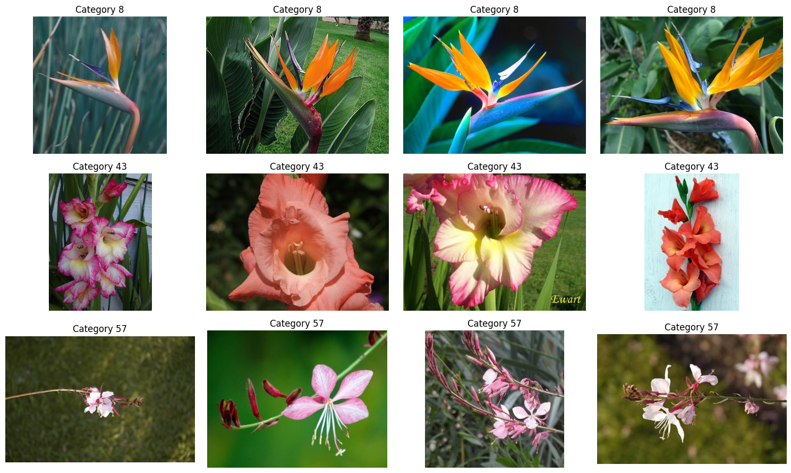

# Flower Species Classification using ResNet50

## Project Overview

This project focuses on the classification of 102 flower species from the Oxford 102 Flowers dataset using a deep learning model based on the ResNet50 architecture. The goal is to accurately identify the species of flowers from images by leveraging transfer learning with pre-trained convolutional neural networks.



## Dataset

The [Oxford 102 Flower Dataset](https://www.robots.ox.ac.uk/~vgg/data/flowers/102/) contains 102 flower categories commonly found in the United Kingdom. Each class consists of between 40 and 258 images, with a total of 8189 images. The flowers are carefully selected to have large variations in scale, pose, and lighting, making this a challenging classification task.

### Class Distribution

The dataset has a relatively balanced distribution of images across the 102 flower categories:


## Libraries Used

- **PyTorch and torchvision**: For deep learning model creation, training, and evaluation
- **NumPy and Pandas**: For numerical operations and data manipulation
- **Matplotlib and Seaborn**: For data visualization and plotting metrics
- **SciPy**: For loading MATLAB data files containing image labels
- **tqdm**: For progress tracking during training and data processing
- **Logging**: For tracking the execution and saving important information

## Data Acquisition and Exploration

### Downloading the Dataset

The dataset is downloaded from the Oxford Visual Geometry Group's website using wget:

```bash
# Downloading all the data using wget command if not already downloaded
[ ! -f setid.mat ] && wget "https://www.robots.ox.ac.uk/~vgg/data/flowers/102/setid.mat"
[ ! -f imagelabels.mat ] && wget "https://www.robots.ox.ac.uk/~vgg/data/flowers/102/imagelabels.mat"
[ ! -f 102flowers.tgz ] && wget "https://www.robots.ox.ac.uk/~vgg/data/flowers/102/102flowers.tgz"

# Extracting the data from archived files if not already extracted
[ -f 102flowers.tgz ] && tar xvf 102flowers.tgz

# Removing the useless archived file
[ -f 102flowers.tgz ] && rm -rf 102flowers.tgz
```

### Data Exploration

The dataset includes:

- 102 different flower categories
- Labels stored in MATLAB format files
- Images stored in JPEG format

Distribution analysis shows that the dataset has a balanced representation across the 102 flower categories, with each category having approximately 40-258 images.

### Directory Organization

After downloading, the images are organized into directories based on their class labels:

```
data/
  ├── 1/            # Flower category 1
  │   ├── image_00001.jpg
  │   ├── image_00002.jpg
  │   └── ...
  ├── 2/            # Flower category 2
  └── ...
```

## Data Preprocessing

### Image Transformations

Images are processed using the following transformations:

```python
transform = transforms.Compose([
    transforms.Resize((256, 256)),  # Resize images
    transforms.CenterCrop(224),     # Center crop to 224x224
    transforms.RandomHorizontalFlip(), # Augmentation: Random horizontal flip
    transforms.ToTensor(),          # Convert to Tensor
    transforms.Normalize(mean=[0.485, 0.456, 0.406], std=[0.229, 0.224, 0.225]) # ImageNet normalization
])
```

### Dataset Splitting

The dataset is split into training (80%) and validation (20%) sets:

```python
# Split dataset into training and validation sets
train_size = int(0.8 * len(dataset))
val_size = len(dataset) - train_size
train_dataset, val_dataset = random_split(dataset, [train_size, val_size])
```

## Model Architecture

### Base Model

The project uses a pre-trained ResNet50 model as the base architecture:

```python
# Load pretrained ResNet50 model
model = models.resnet50(pretrained=True)
```

### Transfer Learning Approach

The transfer learning approach includes:

1. Freezing all layers of the pre-trained ResNet50 model
2. Replacing the final fully-connected layer with a new one that outputs 102 classes
3. Only training the new fully-connected layer, leveraging the feature extraction capabilities of the pre-trained layers

```python
# Freeze all layers except the final fully connected layer
for param in model.parameters():
    param.requires_grad = False

# Modify the final fully connected layer for 102 flower classes
num_classes = 102
model.fc = nn.Linear(model.fc.in_features, num_classes)
```

## Training Process

### Training Setup

- **Loss Function**: Cross-Entropy Loss
- **Optimizer**: SGD with learning rate 0.001 and momentum 0.9
- **Batch Size**: 32
- **Number of Epochs**: 20
- **Device**: CUDA (GPU) if available, otherwise CPU

### Training Loop

The training loop includes:

1. Forward pass through the network
2. Loss calculation using cross-entropy
3. Backpropagation of gradients
4. Parameter updates using SGD optimizer
5. Metrics tracking for both training and validation sets

### Training Metrics

During training, the following metrics are tracked:

- Training Loss
- Training Accuracy
- Validation Loss
- Validation Accuracy

## Results and Evaluation

### Performance Metrics

After 20 epochs of training, the model achieved approximately:

- Training Accuracy: ~95%
- Validation Accuracy: ~82.5%

### Visualization

The training and validation metrics are visualized to analyze the model's performance:


```python
# Plotting Loss
plt.subplot(1, 2, 1)
plt.plot(train_metrics['loss'], label='Training Loss')
plt.plot(val_metrics['loss'], label='Validation Loss')
plt.xlabel('Epoch')
plt.ylabel('Loss')
plt.title('Training and Validation Loss')
plt.legend()

# Plotting Accuracy
plt.subplot(1, 2, 2)
plt.plot(train_metrics['accuracy'], label='Training Accuracy')
plt.plot(val_metrics['accuracy'], label='Validation Accuracy')
plt.xlabel('Epoch')
plt.ylabel('Accuracy')
plt.title('Training and Validation Accuracy')
plt.legend()
```

## Challenges and Considerations

1. **Dataset Complexity**: The Oxford 102 Flowers dataset is challenging due to variations in flower orientation, lighting conditions, and backgrounds.
2. **Limited Data**: With only about 8,189 images spread across 102 classes, each class has relatively few examples.
3. **Computational Resources**: Training deep learning models requires significant computational resources.
4. **Overfitting**: The relatively small dataset makes the model prone to overfitting, requiring careful application of regularization techniques.

## Future Improvements

Several strategies could improve the model's performance:

1. **Increase the number of training epochs**: While we trained for 20 epochs, more epochs might lead to better convergence.
2. **Fine-tune more layers**: Rather than only training the last layer, consider unfreezing and fine-tuning more layers of the ResNet50 model.
3. **Experiment with different optimizers and learning rates**: Try Adam or other optimizers, and tune the learning rate for potentially faster and better convergence.
4. **Enhanced data augmentation**: Explore more advanced techniques like rotation, color jittering, or random cropping to increase training data diversity.
5. **Regularization techniques**: Apply dropout or batch normalization to further improve generalization and reduce overfitting.
6. **Model ensembling**: Train multiple models and combine their predictions for potentially higher accuracy.
7. **Test time augmentation**: Apply multiple transformations during inference and average predictions.

## How to Use

1. Clone this repository:

```bash
git clone https://github.com/username/Flowers-Classification-CV-.git
cd Flowers-Classification-CV-
```

2. Install the required dependencies:

```bash
pip install torch torchvision numpy pandas matplotlib seaborn scipy tqdm
```

3. Run the Jupyter notebook:

```bash
jupyter notebook "Flowers CV.ipynb"
```

4. Follow the steps in the notebook to train and evaluate the model.

## Conclusion

This project demonstrates the effectiveness of transfer learning for specialized image classification tasks. By leveraging a pre-trained ResNet50 model and fine-tuning only the final layer, we achieved good performance on the challenging task of flower species classification. The approach shows that even with limited training data and computational resources, deep learning can be successfully applied to specialized image classification problems.

## References

1. Nilsback, M-E. and Zisserman, A. "Automated flower classification over a large number of classes" Proceedings of the Indian Conference on Computer Vision, Graphics and Image Processing (2008)
2. [PyTorch documentation](https://pytorch.org/docs/stable/index.html)
3. [Oxford 102 Flower Dataset](https://www.robots.ox.ac.uk/~vgg/data/flowers/102/)
4. He, K., Zhang, X., Ren, S., & Sun, J. (2016). "Deep residual learning for image recognition." In Proceedings of the IEEE conference on computer vision and pattern recognition (pp. 770-778).
